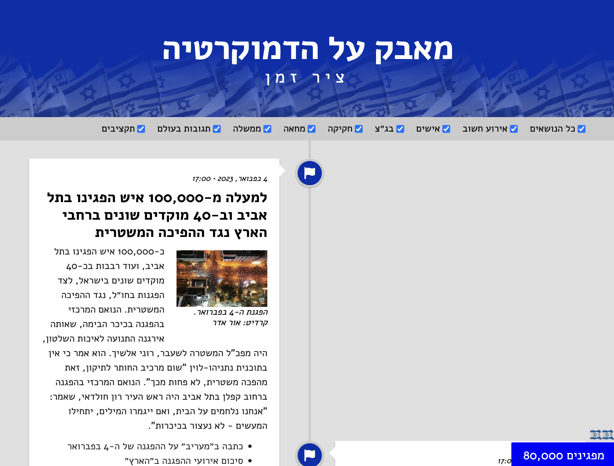

# Fight for Democracy - Timeline

A timeline of events leading up to the 2023 Israeli constitutional crisis.

**Contents**

- [Install](#install)
- [Content](#content)
- [Deploy](#deploy)
- [Under the hood](#under-the-hood)

## Install

Clone this repository, then run `npm install` from the directory.

`npm run-script serve` will build the project and serve the static files locally at http://localhost:8080. `npm run-script build` just runs the build step without starting the development server.

## Content

The entries are hosted in Sanity.io and are fetched using the [Sanity client](https://www.sanity.io/docs/js-client). The Sanity client is configured in `src/js/sanity.js`.

## Deploy

App is deployed on [Vercel](https://vercel.com/). Vercel is configured to build the project on every push to the `main` branch.

## Under the hood

Project is forked from Molly White's [static-timeline-generator](https://github.com/molly/static-timeline-generator)

This project uses

- [11ty](https://www.11ty.dev)
- [EJS](https://ejs.co/)
- [moment.js](https://momentjs.com/)
- [FontAwesome](https://fontawesome.com/)
- [normalize.css](https://github.com/necolas/normalize.css)
- [classlist-polyfill](https://github.com/eligrey/classList.js)
